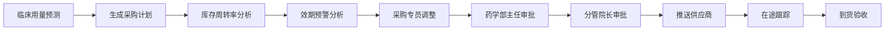
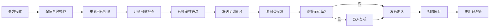
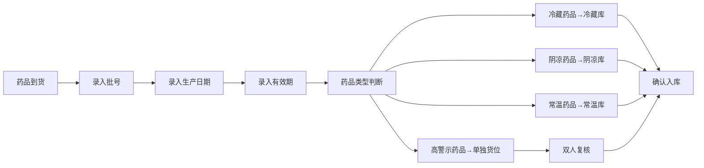

# 医院智慧药房与药品供应链管理系统 PRD

## 1. 产品概述
大型医院智慧药房与药品供应链管理桌面系统，实现药品全生命周期管理，涵盖药品信息、供应商、采购、入库、库存、处方发药、退药、统计分析等全流程智能化管理。

- **核心目标**：提升药房运营效率，降低药品损耗，确保用药安全，实现供应链可视化
- **目标用户**：药师、采购人员、药学部主任、分管院长、药房管理员

## 2. 核心功能

### 2.1 用户角色
| 角色 | 注册方式 | 核心权限 |
|------|----------|----------|
| 系统管理员 | 后台创建 | 系统配置、用户管理、权限分配 |
| 药房管理员 | 后台创建 | 药品信息管理、库存管理、储位配置 |
| 采购专员 | 后台创建 | 供应商管理、采购计划、采购单创建 |
| 药学部主任 | 后台创建 | 采购审批、处方审核、数据统计 |
| 分管院长 | 后台创建 | 采购终审、运营报表查看 |
| 调剂药师 | 后台创建 | 处方调剂、扫码发药、入库验收 |
| 值班药师 | 后台创建 | 温湿度监控、报警处理、退药处理 |

### 2.2 功能模块
1. **仪表板**：实时数据概览、温湿度监控、库存预警、待办事项
2. **药品信息管理**：药品基础信息录入、分类管理、效期管理
3. **供应商管理**：供应商资质、GSP证书、供货评级管理
4. **采购管理**：智能采购计划、多级审批、订单跟踪
5. **入库管理**：到货验收、批号管理、智能储位分配
6. **库存管理**：库存查询、盘点、效期预警、批号追溯
7. **处方管理**：处方审核、配伍禁忌校验、调剂发药
8. **温湿度监控**：实时监控、超限报警、历史记录
9. **退药管理**：退药申请、批次核对、回库处理
10. **统计分析**：多维度统计、运营报表、可视化药房平面图

### 2.3 页面详情
| 页面名称 | 模块名称 | 功能描述 |
|----------|----------|----------|
| 仪表板 | 数据概览 | 关键指标卡片、温湿度实时曲线、库存预警列表、待审批事项 |
| 药品信息 | 药品列表 | 药品CRUD、搜索筛选、批量导入导出 |
| 药品信息 | 药品详情 | 通用名、商品名、剂型、规格、生产厂家、批准文号、储位要求 |
| 供应商管理 | 供应商列表 | 供应商CRUD、资质查看、评级统计 |
| 供应商管理 | 资质管理 | 营业执照、GSP证书上传、有效期提醒、供货范围配置 |
| 采购管理 | 采购计划 | 自动生成采购计划、人工调整、用量预测展示 |
| 采购管理 | 采购审批 | 待审批列表、审批意见、审批历史记录 |
| 采购管理 | 订单跟踪 | 供应商通知、在途状态、到货时间预测 |
| 入库管理 | 到货验收 | 扫码验收、批号录入、生产日期/有效期录入 |
| 入库管理 | 储位分配 | 自动分配库区（冷藏/阴凉/常温）、高警示药品特殊处理 |
| 库存管理 | 库存查询 | 多维度查询、库存分布热力图、批号追溯链 |
| 库存管理 | 效期预警 | 近效期药品列表、自动生成退/换货建议 |
| 处方管理 | 处方审核 | 配伍禁忌校验、重复用药检测、儿童用量检查 |
| 处方管理 | 处方调剂 | 楼层调剂台分配、扫码确认发药、双人复核 |
| 温湿度监控 | 实时监控 | 各库区温湿度实时数据、声光报警模拟 |
| 温湿度监控 | 历史数据 | 趋势图表、超限记录、值班处理记录 |
| 退药管理 | 退药处理 | 原批次核对、包装完整性检查、自动回库 |
| 统计分析 | 数据报表 | 采购金额、周转天数、效期损失率统计 |
| 统计分析 | 可视化大屏 | 药房平面图、温湿度分布、库存热力图 |

## 3. 核心流程

### 3.1 药品采购审批流程

### 3.2 处方发药流程

### 3.3 入库流程

## 4. 用户界面设计

### 4.1 设计风格
- **主色调**：医疗蓝 (#165DFF) - 代表专业、信任
- **辅助色**：成功绿 (#00B42A)、警告橙 (#FF7D00)、危险红 (#F53F3F)
- **中性色**：深灰 (#1D2129)、中灰 (#4E5969)、浅灰 (#C9CDD4)、背景 (#F2F3F5)
- **按钮风格**：圆角8px，主按钮实色填充，次要按钮描边
- **字体**：使用系统字体栈，标题18-24px，正文14px，小字12px
- **布局风格**：左侧导航 + 顶部工具栏 + 内容区卡片式布局
- **图标风格**：线性图标，使用lucide-react图标库

### 4.2 页面设计概述
| 页面名称 | 模块名称 | UI元素 |
|----------|----------|--------|
| 仪表板 | 数据概览 | 网格布局、渐变卡片、实时曲线图、数据表格、状态标签 |
| 药品信息 | 药品列表 | 搜索栏、筛选器、表格、分页、操作按钮组 |
| 采购审批 | 审批流程 | 步骤条、审批单卡片、意见输入框、审批历史时间线 |
| 温湿度监控 | 实时监控 | 仪表盘组件、实时曲线、报警指示灯、库区布局图 |
| 统计分析 | 可视化大屏 | 药房平面图SVG、热力图、柱状图、饼图、数据钻取 |

### 4.3 响应式设计
- **桌面优先**：优化1920x1080及以上分辨率
- **侧边栏**：可折叠，收起后显示图标
- **表格**：支持横向滚动适配小屏幕
- **触控优化**：按钮最小高度40px，保证可点击区域

## 5. 非功能需求
- **性能**：页面加载时间 < 2s，表格渲染 < 500ms
- **安全**：用户登录认证、操作日志记录、数据加密存储
- **可靠性**：关键数据本地缓存，支持离线操作后同步
- **可扩展性**：模块化设计，支持后续扩展智能设备对接
