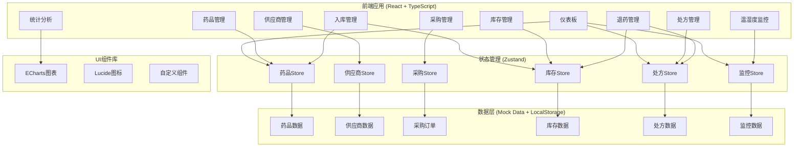
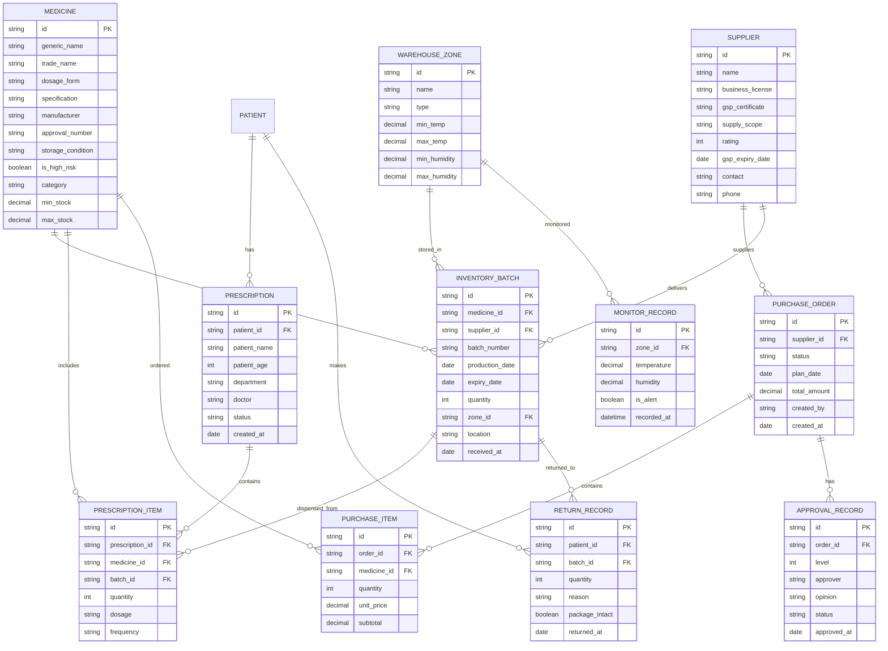

# 医院智慧药房与药品供应链管理系统 技术架构

## 1. 架构设计



## 2. 技术选型

- **前端框架**: React@18 + TypeScript
- **构建工具**: Vite@5
- **样式方案**: TailwindCSS@3
- **状态管理**: Zustand@4
- **路由管理**: React Router@6
- **图表库**: ECharts@5
- **图标库**: lucide-react@0.294
- **UI组件**: 自定义组件库 (基于TailwindCSS)
- **数据持久化**: LocalStorage (Mock数据)
- **代码规范**: ESLint + Prettier

## 3. 路由定义

| 路由 | 页面 | 说明 |
|------|------|------|
| / | 登录页 | 系统登录入口 |
| /dashboard | 仪表板 | 数据概览与实时监控 |
| /medicines | 药品列表 | 药品信息管理 |
| /medicines/:id | 药品详情 | 药品详情与编辑 |
| /suppliers | 供应商列表 | 供应商管理 |
| /suppliers/:id | 供应商详情 | 供应商资质管理 |
| /purchase/plans | 采购计划 | 智能采购计划生成 |
| /purchase/approvals | 采购审批 | 多级审批流程 |
| /purchase/orders | 订单跟踪 | 供应商订单管理 |
| /warehouse/receipt | 到货验收 | 入库验收与储位分配 |
| /inventory/list | 库存查询 | 库存列表与查询 |
| /inventory/expiry | 效期预警 | 近效期药品预警 |
| /prescriptions/review | 处方审核 | 处方审核与校验 |
| /prescriptions/dispense | 处方调剂 | 调剂台发药 |
| /monitor/realtime | 实时监控 | 温湿度实时监控 |
| /monitor/history | 历史数据 | 监控历史记录 |
| /returns/process | 退药处理 | 患者退药管理 |
| /statistics/reports | 统计报表 | 多维度数据统计 |
| /statistics/visual | 可视化大屏 | 药房平面图与热力图 |

## 4. 数据模型

### 4.1 ER图



### 4.2 类型定义

```typescript
// 药品类型
interface Medicine {
  id: string;
  genericName: string;
  tradeName: string;
  dosageForm: string;
  specification: string;
  manufacturer: string;
  approvalNumber: string;
  storageCondition: 'cold' | 'cool' | 'normal';
  isHighRisk: boolean;
  category: string;
  minStock: number;
  maxStock: number;
}

// 供应商类型
interface Supplier {
  id: string;
  name: string;
  businessLicense: string;
  gspCertificate: string;
  supplyScope: string[];
  rating: number;
  gspExpiryDate: string;
  contact: string;
  phone: string;
}

// 采购订单类型
interface PurchaseOrder {
  id: string;
  supplierId: string;
  status: 'draft' | 'pending_dept' | 'pending_hospital' | 'approved' | 'rejected' | 'in_transit' | 'completed';
  planDate: string;
  totalAmount: number;
  items: PurchaseItem[];
  approvals: ApprovalRecord[];
  createdBy: string;
  createdAt: string;
}

// 库存批次类型
interface InventoryBatch {
  id: string;
  medicineId: string;
  supplierId: string;
  batchNumber: string;
  productionDate: string;
  expiryDate: string;
  quantity: number;
  zoneId: string;
  location: string;
  receivedAt: string;
}

// 处方类型
interface Prescription {
  id: string;
  patientName: string;
  patientAge: number;
  department: string;
  doctor: string;
  items: PrescriptionItem[];
  status: 'pending' | 'reviewed' | 'dispensing' | 'completed' | 'returned';
  warnings: PrescriptionWarning[];
  createdAt: string;
}

// 库区类型
interface WarehouseZone {
  id: string;
  name: string;
  type: 'cold' | 'cool' | 'normal' | 'high_risk';
  minTemp: number;
  maxTemp: number;
  minHumidity: number;
  maxHumidity: number;
  currentTemp: number;
  currentHumidity: number;
}
```

## 5. 项目结构

```
/
├── src/
│   ├── components/          # 通用组件
│   │   ├── layout/         # 布局组件
│   │   ├── form/           # 表单组件
│   │   ├── table/          # 表格组件
│   │   └── charts/         # 图表组件
│   ├── pages/              # 页面组件
│   │   ├── dashboard/
│   │   ├── medicines/
│   │   ├── suppliers/
│   │   ├── purchase/
│   │   ├── warehouse/
│   │   ├── inventory/
│   │   ├── prescriptions/
│   │   ├── monitor/
│   │   ├── returns/
│   │   └── statistics/
│   ├── stores/             # Zustand状态管理
│   │   ├── medicineStore.ts
│   │   ├── supplierStore.ts
│   │   ├── purchaseStore.ts
│   │   ├── inventoryStore.ts
│   │   ├── prescriptionStore.ts
│   │   └── monitorStore.ts
│   ├── utils/              # 工具函数
│   │   ├── validation.ts   # 校验逻辑（配伍禁忌等）
│   │   ├── storage.ts      # 本地存储
│   │   └── mock.ts         # Mock数据生成
│   ├── types/              # TypeScript类型定义
│   ├── assets/             # 静态资源
│   ├── App.tsx             # 应用入口
│   ├── main.tsx            # 渲染入口
│   └── index.css           # 全局样式
├── api/                    # 后端API（预留）
├── shared/                 # 共享类型
├── public/                 # 公共资源
├── .trae/
│   └── documents/         # 项目文档
├── package.json
├── vite.config.ts
├── tailwind.config.js
├── tsconfig.json
└── README.md
```

## 6. 核心算法

### 6.1 智能采购计划生成算法
```typescript
// 基于历史用量预测 + 库存周转率 + 效期预警
function generatePurchasePlan(medicine: Medicine, history: UsageHistory[], inventory: InventoryBatch[]): PurchaseItem {
  // 1. 用量预测（移动加权平均）
  const predictedUsage = calculateWeightedAverage(history);
  
  // 2. 库存周转率分析
  const turnoverRate = calculateTurnoverRate(inventory, history);
  
  // 3. 效期预警（近效期库存不计入可用库存）
  const validStock = calculateValidStock(inventory);
  
  // 4. 计算建议采购量
  const suggestedQuantity = Math.max(
    0,
    predictedUsage * (1 + SAFETY_STOCK_RATIO) - validStock
  );
  
  return { medicineId: medicine.id, quantity: suggestedQuantity };
}
```

### 6.2 配伍禁忌校验算法
```typescript
function checkCompatibility(items: PrescriptionItem[], medicines: Medicine[]): CompatibilityWarning[] {
  const warnings: CompatibilityWarning[] = [];
  
  // 检查药物相互作用
  for (let i = 0; i < items.length; i++) {
    for (let j = i + 1; j < items.length; j++) {
      const conflict = findConflict(items[i].medicineId, items[j].medicineId);
      if (conflict) {
        warnings.push({
          type: 'conflict',
          medicines: [items[i].medicineName, items[j].medicineName],
          severity: conflict.severity,
          description: conflict.description
        });
      }
    }
  }
  
  // 检查重复用药（同一药理分类）
  const duplicates = findDuplicateCategories(items, medicines);
  warnings.push(...duplicates);
  
  return warnings;
}
```

### 6.3 智能储位分配算法
```typescript
function allocateStorage(medicine: Medicine, batch: InventoryBatch): StorageLocation {
  // 1. 高警示药品优先分配到单独货位
  if (medicine.isHighRisk) {
    return findHighRiskLocation();
  }
  
  // 2. 根据储存条件分配库区
  const zoneType = medicine.storageCondition;
  
  // 3. 先进先出（FIFO）原则分配货位
  return findFIFOLocation(zoneType, batch.productionDate);
}
```
